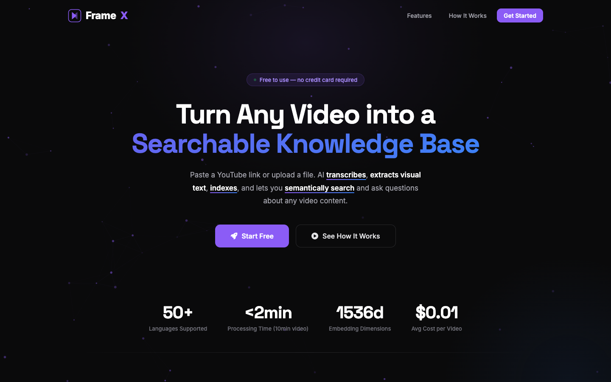
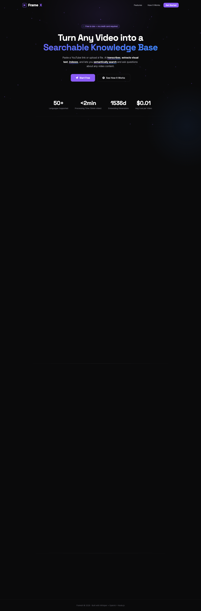
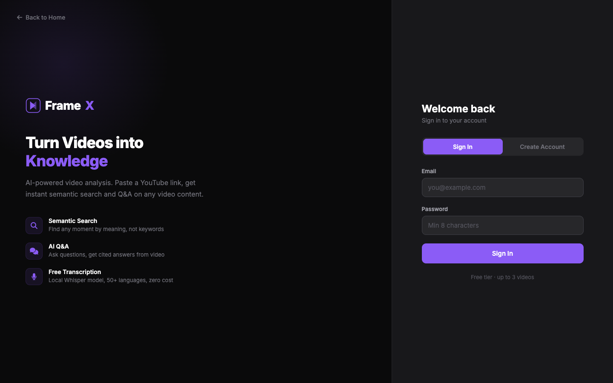
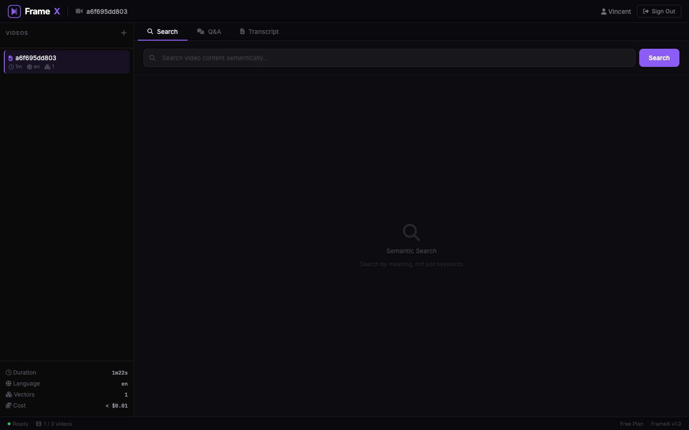

<p align="center">
  
</p>

<h1 align="center">FrameX</h1>

<p align="center">
  <strong>Turn any video into a searchable knowledge base — powered by AI.</strong>
</p>

<p align="center">
  Paste a YouTube link or upload a file. FrameX transcribes, extracts visual text, indexes, and lets you <strong>semantically search</strong> and ask questions about any video content.
</p>

<p align="center">
  <a href="#features">Features</a> &nbsp;&bull;&nbsp;
  <a href="#demo">Demo</a> &nbsp;&bull;&nbsp;
  <a href="#quick-start">Quick Start</a> &nbsp;&bull;&nbsp;
  <a href="#deployment">Deployment</a> &nbsp;&bull;&nbsp;
  <a href="#architecture">Architecture</a> &nbsp;&bull;&nbsp;
  <a href="#cost">Cost</a>
</p>

---

## Features

- **Semantic Search** — Find any moment by meaning, not just keywords. Powered by OpenAI `text-embedding-3-small` (1536-dim vectors)
- **AI Q&A** — Ask questions about video content and get cited answers using GPT-4o-mini with RAG pipeline
- **Free Transcription** — Local Whisper model runs offline. Supports 50+ languages at zero API cost
- **Visual Text Extraction** — OCR via Tesseract.js captures on-screen text (slides, code, subtitles)
- **Multi-user SaaS** — JWT authentication, per-user data isolation, rate limiting
- **File Upload & YouTube** — Supports MP4, MOV, AVI, MKV, WebM, MP3, WAV, M4A, FLAC + YouTube URLs
- **Docker Ready** — One-command deployment with Docker Compose (PostgreSQL + Node.js + Nginx)

## Demo

### Landing Page

<p align="center">
  
</p>

### Authentication

<p align="center">
  
</p>

### Dashboard

IDE-like interface with video library, semantic search, Q&A, and transcript browsing.

<p align="center">
  
</p>

## Quick Start

### Prerequisites

- **Node.js** 20+
- **PostgreSQL** 16+
- **FFmpeg** installed (`brew install ffmpeg`)
- **Python 3** with venv (for local Whisper)
- **OpenAI API Key**

### 1. Clone & Install

```bash
git clone https://github.com/your-username/framex.git
cd framex
npm install
```

### 2. Set Up Whisper (local transcription)

```bash
python3 -m venv whisper-env
source whisper-env/bin/activate
pip install openai-whisper
deactivate
```

### 3. Configure Environment

```bash
cp .env.example .env
```

Edit `.env`:

```env
OPENAI_API_KEY=sk-your-key-here
DATABASE_URL=postgresql://user@localhost:5432/videorag
JWT_SECRET=your-secret-key
WHISPER_MODEL_SIZE=base    # tiny | base | small | medium | large
PORT=3000
```

### 4. Set Up Database

```bash
psql -c "CREATE DATABASE videorag;"
psql -d videorag -f db/init.sql
```

### 5. Start

```bash
node knowledge-base-ui/server.js
```

Open `http://localhost:3000` in your browser.

## Deployment

### Docker Compose (Recommended)

The project ships with a complete Docker stack:

```bash
# Build and start all services
docker compose up --build -d

# View logs
docker compose logs -f

# Stop
docker compose down
```

This starts 3 services:

| Service | Description | Port |
|---------|-------------|------|
| **db** | PostgreSQL 16 | 5432 (internal) |
| **app** | Node.js + Whisper | 3000 (internal) |
| **nginx** | Reverse proxy + SSL | 80, 443 |

### Production Checklist

- [ ] Change `JWT_SECRET` and `PG_PASSWORD` to strong random values
- [ ] Enable HTTPS — uncomment SSL block in `nginx/nginx.conf`, run Certbot
- [ ] Configure domain DNS to point to your server
- [ ] Set `NODE_ENV=production`
- [ ] Set up database backups (pg_dump cron)
- [ ] Monitor OpenAI API usage

### Server Requirements

| Resource | Minimum | Recommended |
|----------|---------|-------------|
| CPU | 1 core | 2 cores |
| RAM | 2 GB | 4 GB |
| Storage | 10 GB | 20 GB+ |
| OS | Ubuntu 22.04 | Ubuntu 24.04 |

## Architecture

```
                    ┌──────────────┐
                    │    Nginx     │ :80 / :443
                    │ (SSL, Rate   │
                    │  Limiting)   │
                    └──────┬───────┘
                           │
                    ┌──────▼───────┐
                    │   Express.js │ :3000
                    │              │
                    │  ┌─────────┐ │     ┌──────────────┐
                    │  │ Auth    │ │────▶│ PostgreSQL   │
                    │  │ (JWT)   │ │     │ users, videos│
                    │  └─────────┘ │     └──────────────┘
                    │              │
                    │  ┌─────────┐ │     ┌──────────────┐
                    │  │ Search  │ │────▶│ OpenAI API   │
                    │  │ & Q&A   │ │     │ Embeddings   │
                    │  └─────────┘ │     │ GPT-4o-mini  │
                    │              │     └──────────────┘
                    │  ┌─────────┐ │
                    │  │ Process │ │     ┌──────────────┐
                    │  │ Pipeline│ │────▶│ Local Whisper│
                    │  └─────────┘ │     │ FFmpeg       │
                    │              │     │ Tesseract OCR│
                    └──────────────┘     └──────────────┘

Processing Pipeline:
  YouTube URL / File Upload
       │
       ▼
  ┌──────────┐   ┌──────────┐   ┌──────────┐
  │ Download │──▶│ Extract  │──▶│Transcribe│
  │ (yt-dlp) │   │  Audio   │   │ (Whisper)│
  └──────────┘   │ (FFmpeg) │   └────┬─────┘
                 └──────────┘        │
                                     ▼
  ┌──────────┐   ┌──────────┐   ┌──────────┐
  │  Store   │◀──│ Embed    │◀──│  Chunk   │
  │ (JSON)   │   │ (OpenAI) │   │  Text    │
  └──────────┘   └──────────┘   └──────────┘
```

### Tech Stack

| Layer | Technology |
|-------|-----------|
| **Frontend** | Vanilla HTML/CSS/JS (no framework) |
| **Backend** | Node.js 20, Express.js |
| **Database** | PostgreSQL 16 |
| **Auth** | JWT + bcryptjs |
| **Transcription** | OpenAI Whisper (local) |
| **Embeddings** | OpenAI text-embedding-3-small |
| **LLM** | GPT-4o-mini |
| **OCR** | Tesseract.js |
| **Video** | yt-dlp, FFmpeg |
| **Vector Store** | JSON files + cosine similarity |
| **Deployment** | Docker, Nginx |

### API Endpoints

```
POST /api/auth/register       Register new user
POST /api/auth/login          Login, receive JWT

GET  /api/videos              List user's videos
POST /api/process-video       Process YouTube URL
POST /api/upload-video        Upload local file
GET  /api/process-status/:id  Check processing progress

POST /api/search              Semantic search
POST /api/ask                 AI Q&A
GET  /api/video-info          Video metadata
GET  /api/transcript          Full transcript
```

## Cost

FrameX uses a **hybrid approach** — free local Whisper for transcription + OpenAI API only for embeddings and Q&A.

| Operation | Cost |
|-----------|------|
| Transcription (Whisper) | **Free** (runs locally) |
| Video processing (1 hour) | ~$0.02 |
| Semantic search | ~$0.00002 / query |
| Q&A question | ~$0.0001 / question |

> **$10 OpenAI credit** = ~500 hours of video processing, 500K searches, or 100K Q&A questions.

### Processing Time

| Video Length | Whisper (base) | Total Pipeline |
|-------------|---------------|----------------|
| 10 min | ~1 min | ~3 min |
| 30 min | ~3 min | ~6 min |
| 1 hour | ~6 min | ~12 min |

## Security

- Passwords hashed with bcryptjs (salted)
- JWT authentication (7-day expiration)
- Rate limiting (Nginx + express-rate-limit)
- Input validation on all endpoints
- `execFile` instead of `exec` to prevent command injection
- Helmet.js security headers
- Per-user data isolation
- Parameterized SQL queries

## Project Structure

```
framex/
├── knowledge-base-ui/        # Express.js app + frontend
│   ├── server.js              # Main server (800+ lines)
│   ├── db.js                  # PostgreSQL connection
│   ├── middleware/             # Auth, validation, rate limiting
│   ├── routes/                # Auth routes
│   ├── landing.html           # Marketing page
│   ├── login.html             # Authentication
│   └── index.html             # Main dashboard
├── db/
│   ├── init.sql               # Database schema
│   └── migrate.js             # Migration runner
├── docker/
│   ├── Dockerfile
│   ├── docker-compose.yml
│   └── nginx/nginx.conf
├── process-video-from-url.js  # YouTube processing script
├── process-local-file.js      # File upload processing
├── extract-frames-ocr.js      # OCR extraction
├── run-whisper.sh             # Whisper wrapper
├── .env.example
└── package.json
```

## License

MIT
